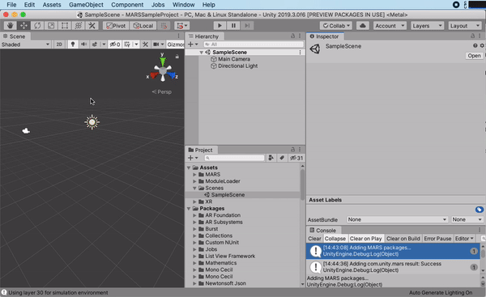
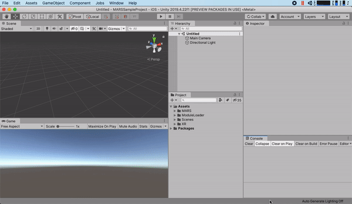
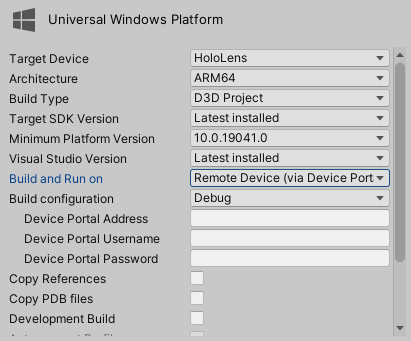
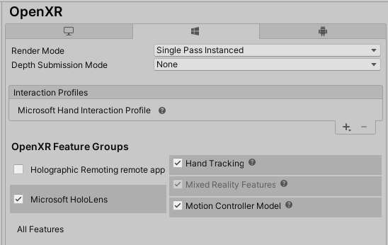
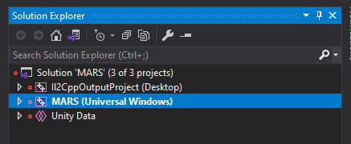
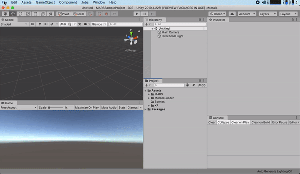
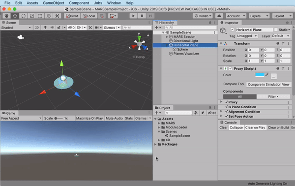
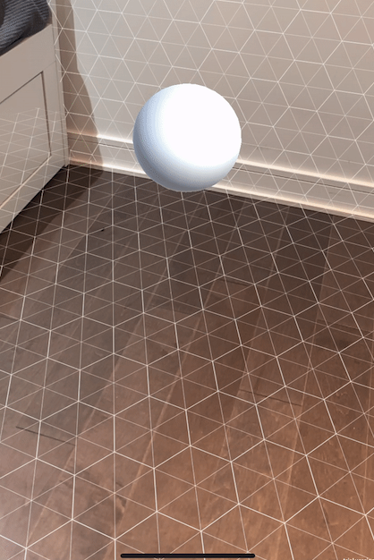

# Building to devices with Unity MARS
This guide will show you how to use MARS to create a simple AR application that places a sphere on a surface, and build your application to an iOS or Android mobile device.
Before getting started, make sure you have read the [requirements](index.md#requirements) to ensure your project meets the minimum requirements. Bear in mind that this guide is subject to change as different Unity versions come out, so make sure that you are viewing the documentation for the version of Unity MARS you have installed.

If you haven't already installed Unity Mars, follow the instructons in [Installation](xref:mars-install) before continuing.

## Preparing Unity for making builds for Android - iOS
Now that we have MARS installed and all the necessary packages set we are ready to organize Unity for making our builds in the [Build Settings Window](https://docs.unity3d.com/Manual/BuildSettings.html).

By default Unity is set to build to standalone platforms, so next we need to set the device platform we plan to build MARS to; for example, iOS or Android.
To do so, go to **File &gt; Build Settings**, select the platform you plan to build for (iOS / Android), press the `Switch Platform` button, and wait while Unity re-imports the project for the new build target.

### iOS-specific project setup for building with Unity MARS
If you are building for iOS, you will have to do some extra steps by opening the _Project settings_ by either going to **Edit &gt; Project Settings &gt; Player** or **File &gt; Build Settings &gt; Project Settings**. Select the `Other settings` tab and:
1. Set the name of your company and app. This is to avoid name conflicts when creating a bundle identifier in XCode.
2. Set a message when asking for permissions to use the camera.
3. Set the minimum version required for the version of ARFoundation you are planning to use. This is highly dependent on the version of Unity you are using, and the platform(s) you are targeting and the functionality you want to support; for more information check the [ARFoundation docs](https://docs.unity3d.com/Packages/com.unity.xr.arfoundation@latest/index.html) on what is available and required depending on your needs.
4. Set architecture to ARM64.
5. In the `XR Plug-in management` section in the `Project Settings` window, set the checkbox under `ARKit` to enable the plugin provider.

Building Unity projects for iOS devices involves two steps:
1. Unity builds an [XCode project](https://docs.unity3d.com/Manual/StructureOfXcodeProject.html)
2. XCode builds said project to your device.

This guide will take you up until generating an XCode project; you can find more info about iOS build settings **[here](https://docs.unity3d.com/Manual/BuildSettingsiOS.html)**

### Android-specific project setup for building with Unity MARS
To [build and run Android apps](https://docs.unity3d.com/Manual/android-BuildProcess.html) you must install the Unity Android Build Support platform module, the Android Software Development Kit (SDK) and the Native Development Kit (NDK).

It is recommended to use the [Unity Hub](https://docs.unity3d.com/Manual/GettingStartedUnityHub.html) to install Android Build Support and the required dependencies (Android SDK & NDK tools, and OpenJDK). For more detailed information on how to install the SDK and NDK you can follow this link **[here](https://docs.unity3d.com/Manual/android-sdksetup.html)**.

To setup your Unity MARS app to build on Android, follow these steps:

1. In the Unity build settings, set your platform to `Android` by going to **File &gt; Build Settings...**, select `Android`, and click the `Switch Platform` button.
2. Enable _ARCore_ in the `XR-Plugin management` section in the _Project Settings_ window by either going to **Edit &gt; Project Settings &gt; XR-Plugin management** or **File &gt; Build Settings &gt; Project Settings &gt; XR-Plugin Management** to activate the plugin provider.
3. Disable **Auto Graphics API** to make sure the **Vulkan** Graphics API is not enabled. Go to **Edit &gt; Project Settings** in the **Player** section on the left, in the **Other Settings** foldout under the **Rendering** header. Disable **Auto Graphics API**.
4. If 'Vulkan' appears in the list of **Graphics APIs** under 'Auto Graphics API', select 'Vulkan' from the list and then click the '-' button in the lower right corner of the list.

**Note**

Android's **ARCore** does not currently support the **Vulkan** rendering APIs and will not work if 'Vulkan' is your application's graphics API.

If you end up getting errors and can't enable the `ARCore` plugin provider, then most likely you have different ARFoundation and ARCore versions. **Make sure that your ARCore package version matches the installed ARFoundation package version in Package Manager.**

## Preparing Unity for making builds for HoloLens 2 & OpenXR

There are various ways to work with the HoloLens 2 in Unity but for version 2020 onwards [Microsoft recommends using OpenXR](https://docs.microsoft.com/en-us/windows/mixed-reality/develop/unity/xr-project-setup?tabs=openxr). You will need Unity's OpenXR package, which can be installed from the package manager, and `Microsoft's Mixed Reality OpenXR Plugin` which is installed via their [Mixed Reality Feature Tool](https://docs.microsoft.com/en-us/windows/mixed-reality/develop/unity/welcome-to-mr-feature-tool).  You may also want to install the `Mixed Reality Scene Understanding` package if you are intending to use meshing.

These are the steps required to build to your project to HoloLens2 with OpenXR:

- Setup your project for Universal Windows Platform

    Ensure that you are using Unity 2020 or later and have installed the **Universal Windows Platform Build Support** and **Windows Build Support (IL2CPP)** components.

    In **File > Build Settings&hellip;** switch to the **Universal Windows Platform** and set the settings as shown.

    

- Setup Visual Studio

    In the Visual Studio installer ensure you have the [following workloads installed](https://docs.microsoft.com/en-us/windows/mixed-reality/develop/install-the-tools):

    - Desktop Development with C++
    - Universal Windows Platform (UWP) development
    - Game development with Unity

    Within the UWP workload ensure the following components are selected:

    - Windows 10 SDK version 10.0.19041.0 or 10.0.18362.0
    - USB Device Connectivity (required to deploy/debug to HoloLens over USB)
    - C++ (v142) Universal Windows Platform tools (required when using Unity)

    If you have not already set up your HoloLens for development, follow [Microsoft's guide](https://docs.microsoft.com/en-us/windows/mixed-reality/develop/platform-capabilities-and-apis/using-visual-studio?tabs=hl2#enabling-developer-mode).

- Install the required packages

    In **Window > Package Manager** from the Unity Registry add the `AR Foundation` and `OpenXR Plugin` packages.

    If you get an error about the type name `VisualElement` not being found then you will also need to add the `UIElements` package from the built-in packages.  If you are prompted about enabling the backends for the new input system click **Yes** and the editor will restart.  You can then go to **Edit > Project Settings&hellip; > Player** and set **Active Input Handling** to **Both** (the editor will restart).

    The HoloLens OpenXR package is distributed by Microsoft and installed via the [Mixed Reality Feature Tool](https://docs.microsoft.com/en-us/windows/mixed-reality/develop/unity/welcome-to-mr-feature-tool).  Use it to install the `Mixed Reality OpenXR Plugin` (version 1.0.0 or higher).  To use meshing on the HoloLens you will also want to install the `Mixed Reality Scene Understanding` package.

    

- Configure OpenXR

    In **Edit > Project Settings&hellip; > XR Plug-in Management** select the UWP tab and select **OpenXR** and **Microsoft HoloLens feature group**

    

    Then in the **OpenXR** section add the **Microsoft Hand Interaction Profile** to the **Interaction Profiles** list and ensure the HoloLens feature group is enabled.

    

    If you see any yellow warning signs you can click on them and a validator window will open to suggest settings fixes for your project.

- Build & deploy

    From **File > Build Settings&hellip;** press the **Build** button.  You'll be prompted for a folder to build the project to.  Once built double click on the `<project name>.sln` file to open the project in Visual Studio.

    Make sure that the build settings architecture is set to **ARM64** and whether you want to deploy to the HoloLens over USB ("**Device**") or WiFi ("**Remote Machine**" - [Setup instructions](https://docs.microsoft.com/en-us/windows/mixed-reality/develop/platform-capabilities-and-apis/using-visual-studio?tabs=hl2#deploying-a-hololens-app-over-wi-fi))

    

    Also check in the Solution Explorer that your project (and not IL2CppOutputProject or Unity Data) is highlighted as the startup project - if not then right-click on your project and select **Set as Startup Project**.

    

    You can now choose **Debug > Start Without Debugging** to build the project and deploy it to your attached HoloLens.

    Microsoft also provides [documentation](https://docs.microsoft.com/en-us/windows/mixed-reality/develop/unity/tutorials/mr-learning-base-02?tabs=openxr#building-your-application-to-your-hololens-2).

### Meshing on HoloLens 2

HoloLens 2 can provide two kinds of meshes:

- A simple mesh of the environment.  This is generated quickly and supported by AR Foundation.
- Meshes produced by the [Scene Understanding](https://docs.microsoft.com/en-us/windows/mixed-reality/design/scene-understanding) system.  These are simplified watertight meshes that are classified by the type of surface they represent.

  Meshes are not stable across updates so if you set the refresh interval >= 0 then each refresh will remove all the existing meshes and add a completely new set.

# Creating a scene for testing on a device build
By now you should be ready to start working on your MARS application. Let's create something simple we can use to visualize on our build:

1. Create a new [Unity Scene](https://docs.unity3d.com/Manual/CreatingScenes.html) by clicking on **File &gt; New Scene**.
2. Save the scene (**File &gt; Save as&hellip;**) and call it "Sample Scene".
3. Create a Horizontal Plane [proxy](MARSConcepts.md#proxy) by _right clicking_ on the **Hierarchy view &gt; MARS &gt; Presets &gt; Horizontal Plane**
4. _Right click_ again on the created Horizontal Plane GameObject in the Hierarchy, and select **3D Object &gt; Sphere** and adjust its scale (a good scale would be around 10 cubic centimeters (0.1, 0.1, 0.1)). Make sure the sphere is a child of the `Horizontal Plane` GameObject.
5. Create a **Plane Visualizer** by also _right clicking_ in the Hierarchy view and selecting **MARS &gt; Data Visualizers &gt; Plane Visualizer**.

You should now have a _Horizontal Plane_ GameObject with a child GameObject _Sphere_, a _Planes Visualizer_ GameObject, and a `MARS Session` GameObject, which should have automatically been created for you. With this scene, you will be able to see scanned surfaces, and when an horizontal plane is detected, a sphere will appear.

And that's it!  We are ready to build the project now.

# Building your project to your selected platform
Finally, depending on the platform you are targeting, you will be generating an [XCode project (for iOS builds)](https://docs.unity3d.com/Manual/iphone-GettingStarted.html) or an [`apk` file (for Android builds)](https://docs.unity3d.com/Manual/android-BuildProcess.html).  Depending on the build target, you will have to compile the final build through XCode, or move the generated .apk file to your Android phone.

On Unity's side we just need to:
1. Open the [Build Settings window](https://docs.unity3d.com/Manual/BuildSettings.html) by going to **File &gt; Build Settings&hellip;**
2. Add the created scene by clicking on the **Add Open Scenes** in the scenes build, or dragging the scene into the list from the Project view.
3. Click build.
4. Follow any extra steps necessary for building to your device of choice; either build with [XCode (for iOS builds)](https://docs.unity3d.com/Manual/iphone-GettingStarted.html) or move the generated [`apk` file (for Android builds)](https://docs.unity3d.com/Manual/android-BuildProcess.html) to your device.

Upon starting the app, after the Unity splash screen, you should see a video stream of your camera.

Start moving your device to scan surfaces.  While doing this, you should scanned surfaces displayed with a hexagonal pattern; this is the default effect of the Plane Visualizer we added. When a horizontal plane is detected, the sphere you created as a child of the Horizontal Plane Proxy will appear as shown in the image.

# Troubleshooting
If you are getting a black screen after building your project, check that you have installed these packages:
* `com.unity.mars-ar-foundation-providers`
* `com.unity.xr.arfoundation`

And one or both of the following:
* `com.unity.xr.arkit`
* `com.unity.xr.arcore`

If you are still seeing a black screen, please refer to the [FAQ](FAQ.md) for some common causes. If you followed this step by step guide you should not have any problems.

If you are seeing several compile errors, make sure your `ARFoundation`, `ARCore` and / or `ARKit` packages **have the same major and minor versions** and that you are using a version of Unity that supports that version of AR Foundation. Note that some issues can be caused by using ARFoundation in older Unity 2019.4 versions.

If you have errors when generating a build, check that the version you have specified for `ARCore` / `ARKit` is supported by the SDK version.  Otherwise, you will not be able to build to your devices.
