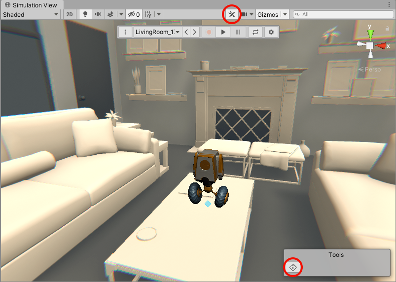
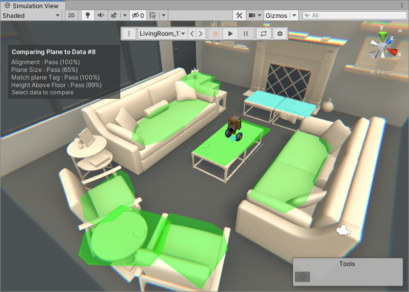
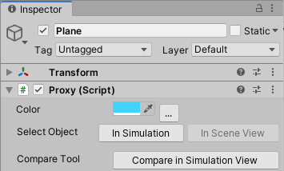
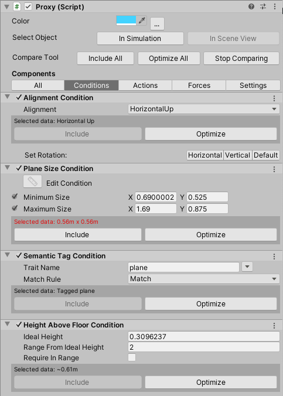

# Compare tool

Use the Compare tool to inspect how Unity MARS evaluates the data match for a Proxy in the Simulation View. While using the Compare tool, the Simulation view will display visualizations of the AR data.

## Using the tool in the Simulation view

To access the Compare tool, from Unity's toolbar, click the **Compare Tool** icon. You can also access it from **Available Custom Editor Tools**.

When the Compare tool is active, Unity displays an overlay box in the top-left of the Simulation view. This box gives more information about what is being compared and provides a summary of the MARS Database rating.

The Unity MARS query system calculates a rating for the Proxy for every piece of data.

When you select a Proxy GameObject, the visualizations of the data will change color to indicate their rating for the given proxy. You can modify the colors used to indicate rating in Project Settings under **MARS &gt; Editor Visuals &gt; Simulation Data Visuals &gt; Rating Gradient**. The default gradient colors are:

* Green data: Passes all conditions. Brighter green indicates that the data is closer to a 100% overall match for the conditions.
* Gray data: Does not pass all conditions.

The Proxy will match to the highest-rated data that has been found, but also respect other Proxies that may have the reserved ownership of the data.

## Using the Compare tool in the Inspector

From a Proxy's Inspector window, click the **Compare in Simulation** button to activate the Compare tool.

While the Compare tool is active, the Inspector window displays more information about how the selected simulation data compares to individual conditions.

You can use the following controls to control how the Compare tool works with data and conditions:

|**Button**|**Description**|
|---|---|
|**Include**|Adjusts the condition settings so that the selected data is included as an acceptable value.|
|**Optimize**|Adjusts the condition settings so that the selected data is the ideal value. **Note:** This might make other data that previously matched now fall outside of the allowed range.|
|**Include All**|Performs the include action for all conditions where possible.|
|**Optimize All**|Performs the optimize action for all conditions where possible.|
