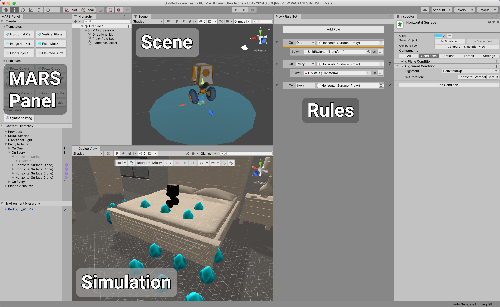
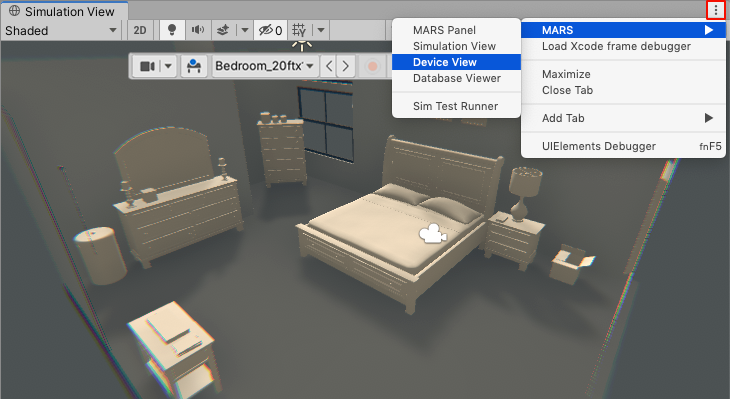
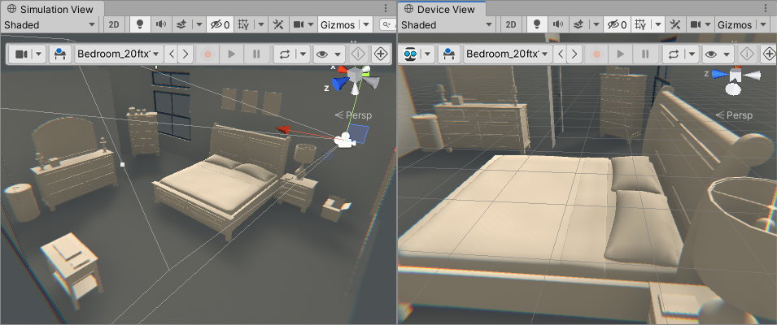
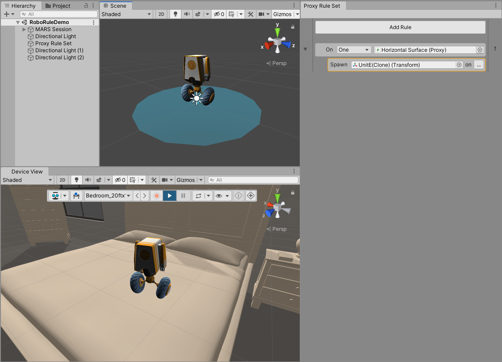
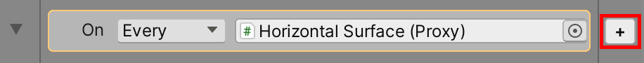
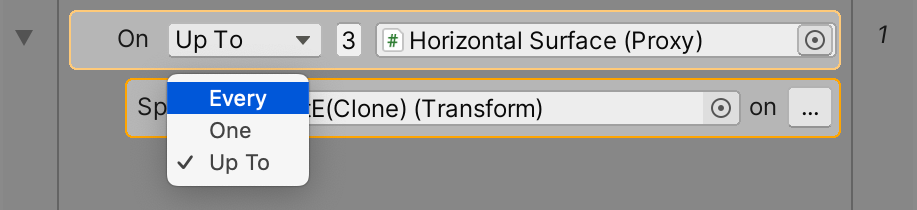
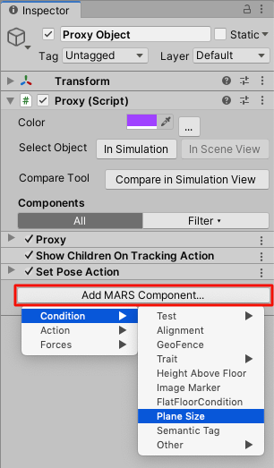
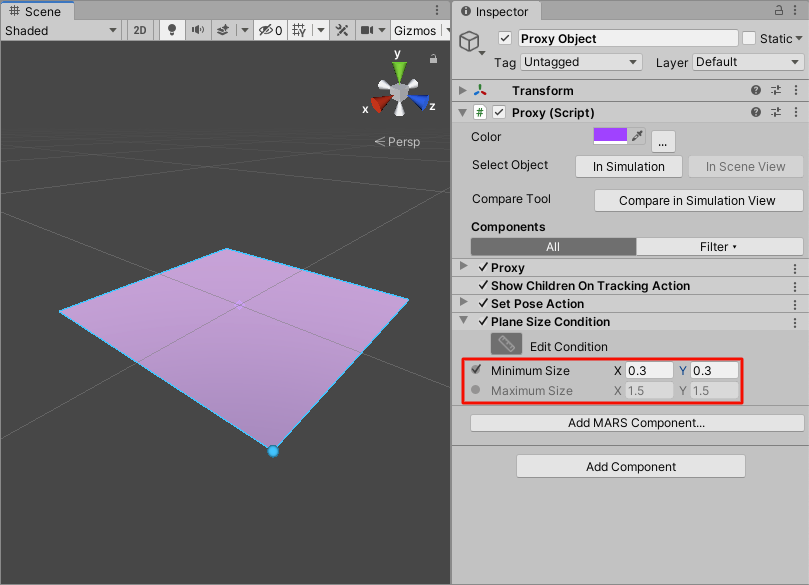
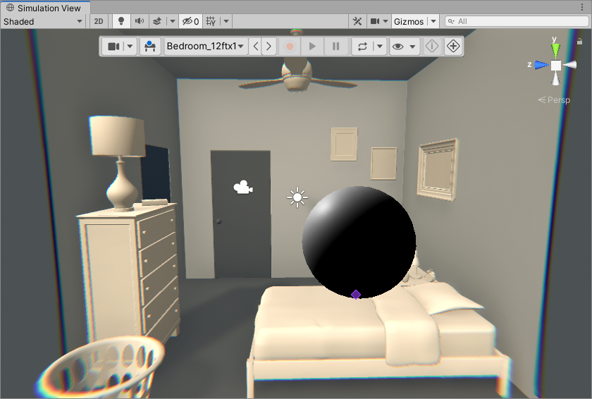
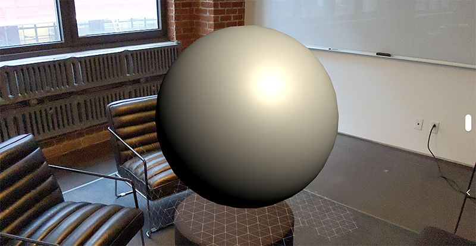

# Getting started with Unity MARS

This guide describes how to create a simple AR application using Unity MARS, and introduces some terminology specific to this package (for a full list of terms, see the [Glossary](Glossary.md)). This example application looks for a surface of a minimum of 30x30cm and places a model on top of it.

The guide assumes no previous experience with Unity MARS and doesn't require you to write any code.

If you haven't already installed Unity Mars, follow the instructons in [Installation](xref:mars-install) before continuing.

## Creating your app

### Overview of the Unity MARS UI

Before you start, take a moment to understand the Unity MARS UI. Unity MARS adds its own sub-menus under Unity's **Window** and **GameObject** menus. It also introduces several new items to the Project view's **Create** menu.

The three primary areas in the Unity MARS workflow are the **Simulation** and **Device** View, the **Proxy Rule Set** View, and the **MARS Panel**. As a best practice, you should keep all of these views open while using Unity MARS. When creating apps, you'll be using all of them.

If any of these views isn't open, you can open it from Unity's main menu: **Window &gt; MARS &gt; Simulation view**, **Window &gt; MARS &gt; Proxy Rule Set**, and **Window &gt; MARS &gt; MARS Panel**.

### Setting up the Unity MARS Device and Simulation views

To get the most out of Unity MARS, use a combination of the Device view and Simulation views, either side-by-side or one above the other. The Device view simulates the view from a device that moves around in the physical world. The Simulation view shows the entire Scene where your Unity MARS app executes.

To open the Simulation and Device views at the same time, open one of the views from Unity's main menu (**Window &gt; MARS &gt; MARS Panel**, or **Window &gt; MARS &gt; Device view**). Then, click the three dots button to open the other view.

Finally, drag the window to have one next to the other.

### Setting up your first Proxy

A **Proxy** is a GameObject in your Scene that represents a real-world object that your app can detect and use as an anchor, such as a table, a face, or a cat. Unity MARS uses Proxies as placeholders where you can anchor content that displays in the real world when a set of conditions are met.

There are two quick starting points to create Proxies: either through the Rules workflow, or through the MARS Panel. The Rules workflow is designed to guide you through setting up your AR content, and is particularly useful for new users. You can also create objects outside of the Rules workflow, as GameObjects in your Hierarchy. This approach will ultimately give you more flexibility in how you set up your scene, but does require a deeper understanding of MARS objects and concepts. For more information about Proxies and other Unity MARS Objects, see the [Unity MARS concepts](MARSConcepts.md) page.

The following guide uses the Rules workflow.

Open the Proxy Rule Set window  by clicking on **Window &gt; MARS &gt; Proxy Rule Set**.

To create your first rule, click the **Add Rule** button. By default, MARS will create a rule that reads "On Every Horizontal Surface" and contains no content. You will see the plane Proxy visualizer in the Scene view, and see generic Proxy gizmos on every matched surface in the Simulation view.

### Adding content to your rule
If you hover your mouse to the right of the "On every horizontal plane" rule, you'll see a **+** button.

Click this button and select **Spawn Object** from the pop-up menu, then select the object to create. After selecting an object, your content will appear in a new indented row under the rule. For simplicity's sake, change the 'Every' dropdown on the rule to 'One'. This will cause MARS to find and spawn only one match of your rule, which you should see reflected in the Simulation view.

For a full walkthrough of the Rules workflow, see the [Rules documentation](Rules.md).

### Adding a plane size condition
Now that you have a basic rule and Proxy for your content, you need to describe what kind of real-world object your Proxy represents. To do this, you add conditions.

A condition is a component that defines a single property of a real-world object, such as size or color. Conditions don't have a typical inspector in the UI; instead, you work with them in the Entity Inspector. Each condition contains a trait and a method to evaluate how well a single instance of that trait's value type matches a value you specify. Think of conditions as the constraints that need to be met in the environment for Unity MARS to match and place your Proxy. Typically, you need to attach multiple conditions to a Proxy to build a complex definition of a real-world object. Conditions should go from general to specific; for example, you start by adding a plane condition, then define the size and orientation for that condition to match.

Add a Plane Size condition to your Proxy. This ensures that your Proxy only displays when Unity MARS finds a surface of a certain size. To add the condition, in the Proxy Inspector, click the **Add MARS Component** button, then select **Condition &gt; Plane Size**.

This attaches a Plane Size condition to your Proxy. You need to configure the condition to have a size of the detected surface of at least 30x30cm. To do this, make sure that the **Maximum Size** property is disabled, and set the **Minimum Size** property to 0.3 for X and Y. This ensures that the model you added fits on the surface.

## Testing your app in a simulated environment

Before you test your content on an actual device, you can use the Simulation view to iterate and make sure your Proxy behaves as it should.

Open the Simulation view from Unity's main menu (**Window &gt; MARS &gt; Simulation View**). The Simulation view demonstrates how your Proxy matches against a simulated surface in a virtual environment. For more information, see documentation on the [Simulation View](UIOverview.md#simulation-view).

## Building your app
Now that you have everything set up and tested in the Simulation View, it's time to build the project to your AR device. You need to compile it to your selected build target. The process for this depends on the platform your app targets, and **Window &gt; MARS &gt; Build Settings Check** will provide supported package versions that may be required. For more information, see Unity's documentation on [Build settings](https://docs.unity3d.com/Manual/BuildSettings.html).

When your app runs, if Unity MARS finds a surface of at least 30x30cm, it places a model on top of it.

## Additional features

This tutorial only describes the basics of working with Unity MARS. To learn more about other Unity MARS features, and about the methods and processes for each feature, see the following guides:

* [Unity MARS UI overview](UIOverview.md)
* [Unity MARS concepts](MARSConcepts.md)
* [The Rules workflow](Rules.md)
* [Working with Unity MARS](WorkingWithMARS.md)
* [Basic face tracking](FaceTracking.md)
* [Image marker tracking](Markers.md)
* [Simulation environments](SimulationEnvironments.md)

For more advanced topics, see:

* [Landmarks](Landmarks.md)
* [Traits](Traits.md)
* [Unity MARS Priorities](Priority.md)
* [Software development guide](SoftwareDevelopmentGuide.md)
