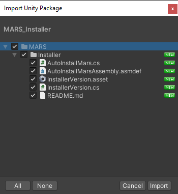
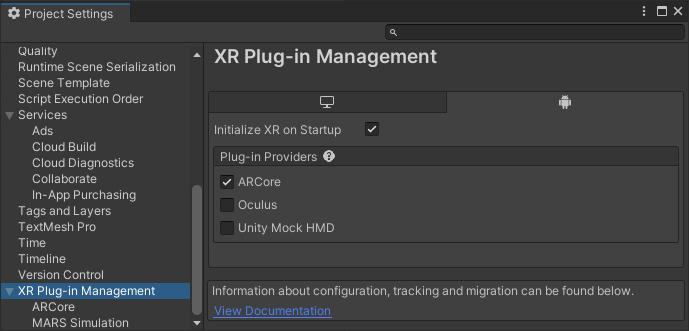
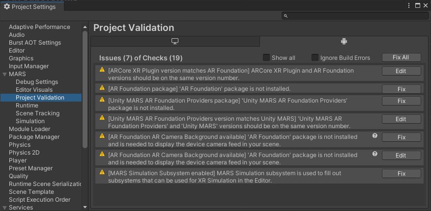
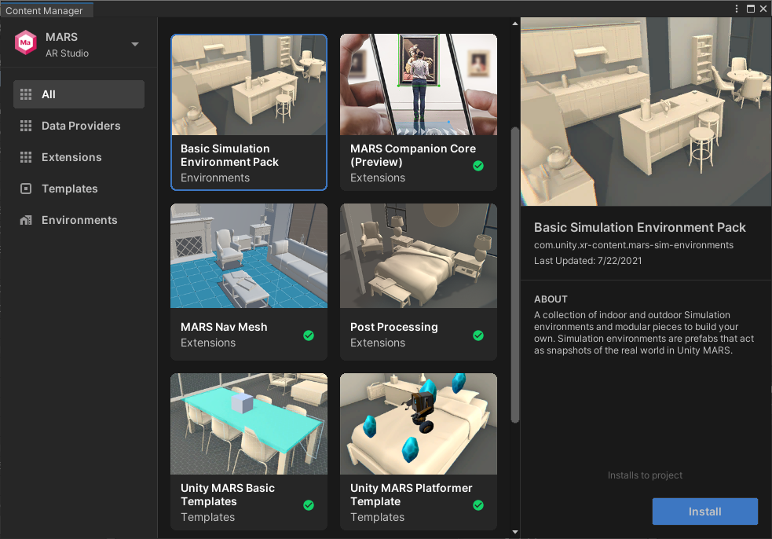

# Install Unity Mars

Perform the following steps to install Mars in a project:

1. [Download and import the Mars installer asset package](#download) 
2. [Add the provider plug-ins](#add-plugins) for the XR platforms and devices that you plan to support.
3. [Validate the project settings](#validate) using the Mars Validation utility.
4. [Add Mars templates and assets](#add-content) to the project.

See [Upgrade an existing Mars project](#upgrade) for instructions about updating an existing Mars project.

## Download and import the Mars installer asset package

To install Mars in a project:

1. Download the installer asset package: [Unity Mars Installer](https://cdn.mars.unity.com/MARS_Installer.unitypackage).
2. Open the project in Unity or create a new project.
3. Import the package with the menu command: __Assets > Import Package > Custom Package__.
4. In the __File Chooser__, navigate to and select the Mars asset package where you downloaded it.
5. Click __Open__.

   

6. Leave all assets in the package selected.
7. Click __Import__.

Unity imports the asset package and sets up Mars in the project. This process involves downloading and adding additional Package Manager packages. It can take a few minutes and requires a stable internet connection.

## Add XR provider plug-ins

To build XR applications, you must enable the provider plugins for the AR and MR platforms that you want to support in the project. For example, you must enable **ARCore** for Android and **ARKit** for iOS:

1. Open the Unity __Project Settings__ window (menu: __Edit > Project Settings__).
2. Select the __XR Plug-in Management__ settings section.
3. Select the tab representing a platform that you plan to support (Windows, Android, iOS).
4. Enable the __Plug-in Provider__ options for that platform.
5. Repeat for additional platforms.
6. Check that the settings for each plug-in are appropriate for your project. 

	 *The ARCore provider plugin enabled for the Android platform*

> [!TIP]
> If you don't see a tab for a platform you want to support, then you must use the Unity Hub to install that platform module for the current Unity Editor. See [Add modules](https://docs.unity3d.com/hub/manual/AddModules.html) in the Unity Hub documentation for instructions.

## Validate Mars project settings

Mars includes a built-in validation utility that checks for potential problems and conflicts in your project settings. You can access this utility in the Mars section of the __Project Settings__ window.

1. Open the Project Settings window (menu: __Edit > Project Settings__).
2. Select the Project Validation page in the Mars settings section.
3. If the utility lists errors or warnings, use the __Fix__ and __Edit__ buttons to correct them.

 *The Mars Project Validation utility flagging a number of configuration issues*

See [Project Validation](ProjectSettings.md#project-validation) for more information about the utility.

## Add templates and sample assets

Mars includes a variety of templates, samples, and optional assets. You can add these assets from the Mars __Content Manager__ window. 

To install the additional templates and samples (after installing Mars):

1. Open the Mars __Content Manager__ (menu: __Window > Content Manager__).

   

2.   Select the item you want to install.
3. Click __Install__.

> [!NOTE]
> The Mars templates and sample assets are added to your project Asset folder. Unity recommends that you keep these files in your project and track them in version control when using Unity MARS. 

## Upgrade an existing Mars project

You can update Mars from the Package Manager window:

1. Open the Unity __Package Manager__ window (menu: __Window > Package Manager__).
2. Select __Unity Mars__ in the list of packages in the project.
3. If a newer version of Mars is available,then you can click the __Update to *n.m.p*__ button at the bottom of the Package Manager window to update to that version. You can also expand the list of versions with  the expand (triangle) icon in front of the Unity Mars name. Click __See other versions__ for the full list of available versions.
4. Check the [Mars Project Validation utility](#validate) to see if there are configuration errors or warnings.

> [!NOTE]
> When you update a package with the Package Manager, Unity also updates any packages on which it depends, if required to maintain compatibility. However, the updated version of a dependent package is not guaranteed to be the latest one available. You should double check that the additional packages installed or updated  are the versions you want to use. 
