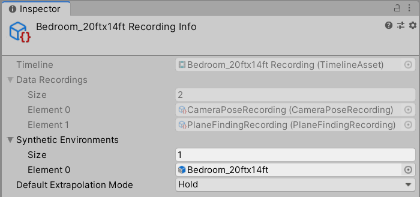

# Session recordings
One way to provide data for a simulation is by playing a recording of an MR session.
The types of session recordings that are currently supported are walkthroughs of [synthetic environments](SimulationEnvironments.md), and videos used for [face tracking](FaceTracking.md).

Synthetic environment walkthroughs can be played while the simulation is in Synthetic mode.
All other recordings can be played while the simulation is in Recorded mode.
For more information, see documentation on the [MARS Panel](UIOverview.md#mars-panel) and [Device View](UIOverview.md#recording-from-the-device-view).

## Creating recordings
### Synthetic environment recordings
You can record a walkthrough of a synthetic environment from the Device View while you have an active simulation.
For more information, see documentation on the [Device View](UIOverview.md#recording-from-the-device-view).

### Video recordings
To create a session recording with a video clip, in the **Project window**, right-click the video clip then select **Create &gt; MARS &gt; Session Recording from Video Clip**.
The created Timeline asset will contain a MARS Video Playable Track with a Timeline clip that references the video clip.

## Structure of a session recording
A session recording consists of a Timeline asset with a Session Recording Info object and a number of Data Recording objects, depending on the types of data included in the recording.

The recording info has a list of synthetic environment prefabs - the set of recordings available for use with a simulation environment consists of recordings that include that environment in this list.
Generally, you shouldn't have to modify this list because when you record a session from a simulation, the recording automatically saves a reference to the current environment.
You can still add other environments that you think a recording applies to.

If a session recording contains any Data Recording objects, then it controls the Unity MARS lifecycle during playback.
Recordings that only contain video do not have any Data Recording objects, so they do not control the Unity MARS lifecycle.
For recordings that do have this control, the time in recording playback maps 1:1 with [MARS Time](SoftwareDevelopmentGuide.md#mars-time).
If you change the time from the Timeline window during playback, the status of simulation will change to "Out of Sync".
For more information about time scrubbing, see documentation on the [MARS Panel](UIOverview.md#mars-panel).

